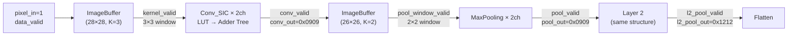

# CKAN Pipeline Timing & Computation Walkthrough

> With **pixel_in = 1** (constant) and **LUT = 1** (every entry), CLK = 8 ns.

## Pipeline Overview



---

## Stage-by-Stage Computation (L1)

### 1. ImageBuffer (generates 3×3 windows)

The buffer collects pixels row by row. With a 28-wide image and 3×3 kernel, it needs **2 full rows + 3 columns** before the first valid 3×3 window is ready.

| Event | Pixel Cycle | Clock Time |
|-------|-------------|------------|
| Reset deasserts | — | ~40 ns |
| First pixel (data_valid=1) | 0 | ~52 ns |
| Row 0 complete (28 px) | 27 | |
| Row 1 complete (56 px) | 55 | |
| First `kernel_valid` ↑ | **58** | **~516 ns** |

> **Why cycle 58?** The row/col counters reach `row=2, col=2` — the first position where a full 3×3 window exists. `kernel_valid` is registered, so it appears 1 cycle after the counter condition is met.

**Pattern of `kernel_valid`** (stride=1):
```
Row 2:  __||||||||||||||||||||||||||  (col 2-27 → 26 highs)
Row 3:  __||||||||||||||||||||||||||  (2 lows for col 0,1 then 26 highs)
Row 4:  __||||||||||||||||||||||||||  (same pattern)
...repeats for rows 2-27 → 26 rows × 26 = 676 total kernel_valid pulses
```

### 2. Conv_SIC_KAN (LUT + Adder Tree)

When `kernel_valid=1`, the 3×3 window is `{1,1,1,1,1,1,1,1,1}` (all pixels = 1).

**Pipeline inside Conv_SIC (2-cycle latency):**

| Cycle (relative to first kernel_valid) | What Happens |
|---|---|
| KV+0 | LUT lookup: `addr={func_id, 4'd1}` → `mem[addr] = 1` for all 9 pixels |
| KV+0 posedge | `lut_r[0..8] <= 1` (registered LUT outputs) |
| KV+1 | Adder tree: `1+1+1+1+1+1+1+1+1 = 9`. `conv_out <= 9` |
| KV+1 posedge | `vpipe` shifts: `00 → 01 → 11` |
| **KV+2** | **`conv_valid` ↑** — first valid conv output! |

**So: first `conv_valid` at pixel cycle 58 + 2 = 60**

### 3. Conv_MIC / ConvolChnl (combinational)

These are purely combinational wrappers:
- `Conv_MIC_KAN`: sums across input channels. L1 has 1 input channel → `sum = 9`
- `ConvolChnl_KAN`: packs 2 output channels → `conv_out = {ch1=9, ch0=9} = 16'h0909`

**No extra latency.** `conv_valid` passes through directly.

### 4. MaxPool2D (buffer + max + register)

Pool receives the 26×26 conv output stream and buffers it to create 2×2 windows.

**Pool ImageBuffer** (COLUMN_NUM=26, KERNEL_SIZE=2, STRIDE=2):
- Needs 1 full row (26 valid inputs) + 2 more columns before first window
- But `conv_valid` has **gaps**: 26 consecutive highs, then 2 lows (for col 0,1 of next input row)
- First pool `kernel_valid`: after ~28 conv_valid cycles

**Pool window contents** (all conv outputs = 9):
```
┌───┬───┐
│ 9 │ 9 │  → max = 9
├───┼───┤
│ 9 │ 9 │
└───┴───┘
```

**MaxPooling internal pipeline (1 cycle):**
- Combinational max: `max_val = max(9,9,9,9) = 9`
- Registered output: `pool_out <= 9` (1 cycle latency)
- `pool_valid` follows 1 cycle after `pool_window_valid`

**L1 pool_out = `{ch1=9, ch0=9}` = `16'h0909` = decimal `ch0=9, ch1=9`**

Expected output count: 13×13 = **169 pool_valid pulses** per image.

---

## Stage-by-Stage Computation (L2)

Layer 2 receives the L1 pooled output (13×13 spatial, 2 channels, 8-bit).

### L2 Conv

- Input: all `9` (8-bit) per channel
- LUT: `addr = {func_id, 8'h09}` → `mem[addr] = 1` (all entries = 1)
- Conv_SIC: 3×3 sum of 1s = **9**
- Conv_MIC: **2 input channels** → `9 + 9 = 18`
- ConvolChnl: 2 output channels → `conv_out = {18, 18} = 16'h1212`

### L2 Pool

- Input: all `18` per channel
- Pool 2×2: `max(18,18,18,18) = 18`
- **l2_pool_out = `{ch1=18, ch0=18}` = `16'h1212` = decimal `ch0=18, ch1=18`**
- Expected: 5×5 = **25 pool_valid pulses** per image

### Flatten

- Collects 25 positions of `16'h1212`
- After all 25 received: `flat_valid` ↑ for 1 cycle
- `flat_out` = 400 bits, all `0x1212` repeating = `0x12121212...`

---

## Waveform Cheat Sheet

What to look for in your waveform viewer:

| Signal | Steady-State Value | Format |
|--------|-------------------|--------|
| `pixel_in` | `4'h1` | Hex |
| `dut.model_inst.layer1.conv_out` | `16'h0909` | Hex |
| `dut.model_inst.layer1.conv_valid` | Pulses (26 high, 2 low pattern) | Binary |
| `l1_pool_out` | `16'h0909` (decimal 9,9) | Hex or Decimal |
| `l1_pool_valid` | Pulses (sparse) | Binary |
| `dut.model_inst.layer1.pool_layer...conv_out` | Internal | — |
| `l2_pool_out` | `16'h1212` (decimal 18,18) | Hex or Decimal |
| `l2_pool_valid` | Pulses (very sparse) | Binary |
| `flat_out` | `400'h1212...1212` | Hex |
| `flat_valid` | 1 pulse per image | Binary |

### Key Timing Landmarks (approximate pixel cycles from first data_valid)

```
Cycle   0: First pixel enters
Cycle  58: First kernel_valid (L1 conv buffer ready)
Cycle  60: First conv_valid (L1 convolution output)
Cycle ~90: First l1_pool_valid (L1 pooling output)
          ← L2 starts receiving data here
Cycle ~700: First l2_pool_valid (L2 pooling output)
Cycle ~750: flat_valid (all 25 L2 pool outputs collected)
```

> [!TIP]
> In your waveform viewer, add `kernel_valid`, `conv_valid`, `pool_window_valid`, `pool_valid` at each stage level to see the valid signals propagate through the pipeline. The data signals should show stable hex values (`0909`, `1212`) whenever their corresponding valid is high.
